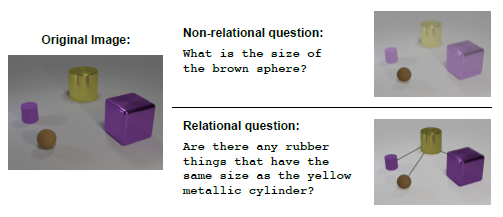

# Summer\_Paper\_Reading_2017

Ref: 
  - https://github.com/rgtjf/Summer_Paper_Reading_2016
  - https://github.com/rgtjf/Paper-Reading-Third-Edition
  
eg: 0-ACL17-Ng-Paper_title.pdf

- Abstract
  - Overview:
  - Advantage:
  - Disadvantage:
  - What can I do? / Can I employ its idea?
- Experiments
  - DataSet:
  - Toolkit:
  - Baseline:
  - Result:

[TOC]

### 1-ICML16-Deepmind-Meta-Leanrning with Memory-augmented Neural Networks
  [PDF](http://proceedings.mlr.press/v48/santoro16.pdf)

  
### 2-Insurance QA
  [Task](), [QA-LSTM](), [Innter-Attention]()

### 3-Mnemonic Reader for Matchine Comprehension

### 4-1706-DeepMind-A simple neural network module for relational reasoning
  [PDF](https://arxiv.org/pdf/1706.01427.pdf), [Pytorch](https://github.com/kimhc6028/relational-networks), [Keras](https://github.com/Alan-Lee123/relation-network)
  
  
   